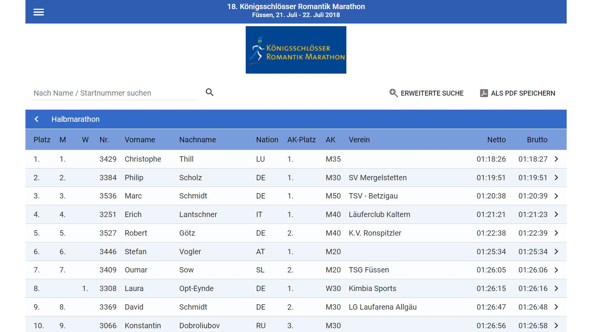

# Run4Fun - Result Service
## Django Web Application for marathon or half marathon events

*This project is a university master's degree course work in Development of Web Applications at Ural Federal University, spring 2022*

Date of completion for evaluation: 10.6.2022

- For site business idea and user interface, read more here https://github.com/JABE22/jabe22.github.io
- Project demo Published in https://jabe22.github.io/ResultService/home.html

**Notes:** 
* Style design (site responsiveness etc.) are not considered here. Please, visit links above.
* This project is not optimized for security issues

### Django framework integration


In this repository, front-end project files from the repository above are integrated to django framework. Also, this project extends demo site by inserting database solution and other django built-in functionalities

**Django built-in functionalities used**
- Database management for admin
- CSV file upload to add data into the database via admin panel
- Models and views to insert data via web site forms (contact and event notification)
- User authentication (login, logout) to get access to hidden content of the site

The following Model-View-Controller structure is implemented


### Python virtual environment

This project does not contain Python environment files. In order to run program in your local machine you probably need to install the following packages
* django 3.2.5
* django-admin-tools 0.9.2
* django-extensions 3.1.5

Web application is developed using Python conda (4.13.0)

## Data flow diagram and main ideology

Following diagram describes how the project data structure is implemented.


### Brief explanation of the main concepts of the chart

Front-end technologies are HTML, CSS and JavaScript. JavaScript is used for reading data from static text and JSON files asyncronously and to build web page content by creating HTML DOM Elements (Nodes). Web page UI functionality is powered by JavaScript.

Back-end works within Python Django framework to read and write into the database. Django API controls navigation between site pages, database functionality such as handling form data, login, admin and other built-in functionalities which will use dynamic database. However, form data validation passes through scripts written by JavaScript and only after successful validation submit event will be directed to the python views and handled there.

In the chart, site management area means service maintenance and part of manual work, in which Run4Fun company representative requests (cooperates event organizer IT team) and receive possible race result data from them. After having access to data, he writes the python scripts in order to transform received data into a suitable format to store it to the Run4Fun web application database.

### About the business idea of the service

For end users (athletes and their coaches, their families and friends) site is planned to be free of charge and read only type (in launch version), except contact form. In later versions, private functionalities for athletes will be added behind user authentication and then customized content will be added to the site (user statistics etc.). At that point, paid content may become a thing to discuss and situation evaluated according to the market.

Business idea covers customers motivation to pay for a service where their events are advertised and event race results accessible via modern and prominent web page for their participants. Idea is to build a website which will be marketed via running event organizers or sport clubs itself and that is possible if it produces added value. Also, one of the greatest motivation is to unite databases between running event organizers from all over world and put the data into the same place.

## Web Application UI introduction

### Website visitor and customer pages

**Home**

Home page consist of motivation picture gallery with changing images using fading (opacity) effect, and stylized phrase text. It's only informative page without clickable components.


**Upcoming events**

Recently passed events are visible, but their opacity value is reduced and orange box shadow effect inserted. Event boxes are clikable and urls set to original event page.


**Past events**

Past events page consist of single race accordion elements. Launch version is planned to have only two level accordions, but later when amount of data increases, will be moved to a three level accordions where first level consists of events, instead of a single competitions (single event can have several races).


**Past events (opened event result list)**


**Search events**

Event and race search page have simple text input box with search tools (hidden by default).
Search function does not have "intelligence" which means that given key word will be compared directly to each data field in the model. However, upper and lower case letters are considered ("ger" is the same as "GER").
* Date filter works as expected filtering both, past and upcoming events similarly. 
* Athlete filter is reserved for planned additional functionality in the future and is therefore disabled (not implemented)


**About**

Informative page without functionality.


**Contact form**

Contact form has a moderate form validation and after success writes data into the database. Database has models (tables) reserved only for the data sent from the contact form.
* After succesful data submission user is redirected to the "/contact" (delay 3 seconds)
* Form fields will be cleared
* Submitting form from the same IP address is not limited (could be limited)


**Events on drill down map**

Map page is launched as a demo version. JavaScript to modify map pins (adding events to the map) is not implemented.


**Event notification form**

This page is accessible only for registered users. Registration is possible only via contact request which will be handled manually. It is possible that user tries to navigate to the "/enote" page and in this case he will be redirected to a login page. After successful login, event notification item appears into the navigation bar and user has access to the page.
Event notification page is planned only for site customers which are marathon event organizers (basically sport clubs)
Page form works similarly as contact form. Some properties of the form:
* Moderate form field validation (Only a few countries are supported)
* Clears data fields after succesfull submit and redirect to /enote (delay set to three seconds)
* Submitting form from the same IP address is not limited (could be limited)


**Login to page**

Simple login form with django built-in backend solution. Successful login enables certain additional page content for customers (event notification). At first, registration to the page is for customers only, requests will be sent via contact form.


### Project admin pages

Admin portal is basically default django user interface. Following images demonstrates how to insert data from csv file to the database. Database management, which consists of inserting marathons event details, is manual human made work since it does not require remarkable effort. However, single races may contain thousands of items and that data must be transformed programmatically. For that purpose csv file upload option is inserted to the default model page.

**Admin home (django built-in)**


**Admin "Results" model (table)**


**Admin "Results" -> csv file upload**


## Database design

Models to handle event details and race results


Models to handle form data of the site


## Usage example for Service Maintenance team

### Introduction

Service maintenace means in this context partly also coding and site back-end development. As mentioned, web application requires data collection from the event organizers. That means cooperation and communication with sport club representatives. Data will be received in any format, according to sport club's own or outsourced service.

In this example we consider data transformation to CSV format and will demonstrate how that data will be saved to the web application's database. This kind of procedure is a prerequisite during the deployment phase of the service. Service's development team strive to automize this procedure in the future.

### Acquiring the data

Result page in the event organizer's web page in certain case may look like this. For now, we start by simply copying data from the screen and saving it to the *halbmarathon-raw.csv* file (10 first rows + header for simplicity of the demonstration)



Pasted raw data in the halbmarathon.csv file will look like this:

```
Platz	M	W	Nr.	Vorname	Nachname	Nation	AK-Platz	AK	Verein	Netto	Brutto
1.	1.		3429	Christophe	Thill	LU	1.	M35		01:18:26	01:18:27
2.	2.		3384	Philip	Scholz	DE	1.	M30	SV Mergelstetten	01:19:51	01:19:51
3.	3.		3536	Marc	Schmidt	DE	1.	M50	TSV - Betzigau	01:20:38	01:20:39
4.	4.		3251	Erich	Lantschner	IT	1.	M40	Läuferclub Kaltern	01:21:21	01:21:23
5.	5.		3527	Robert	Götz	DE	2.	M40	K.V. Ronspitzler	01:22:38	01:22:39
6.	6.		3446	Stefan	Vogler	AT	1.	M20		01:25:34	01:25:34
7.	7.		3409	Oumar	Sow	SL	2.	M20	TSG Füssen	01:26:05	01:26:06
8.		1.	3308	Laura	Opt-Eynde	DE	1.	W30	Kimbia Sports	01:26:15	01:26:16
9.	8.		3369	David	Schmidt	DE	2.	M30	LG Laufarena Allgäu	01:26:47	01:26:48
10.	9.		3066	Konstantin	Dobroliubov	RU	3.	M30		01:26:56	01:26:58
```

### Python data parser for particular event organizer

In the half marathon result raw data file above, we were "lucky" and got all the data such that columns are separated by "\t" mark and we are able to use it as a delimiter in our python data parser. CSV Parser will do the following modifications
* Drops some unwanted data columns
* Renames some columns to be more descriptive
* Combines first and last name columns
* Changes the column order
* Transforms country codes from aplha2 to alpha3 (e.g., "DE" -> "DEU") format using country codes dictionary from the static database of the application
* Saves a transformed csv file into the new file which will be compatible with our application's dynamic SQLite database

#### Data parser code

```python
import pandas as pd
from ccodes import CODES, aplha2to3
import os

# CSV transformer for data from Königsschlösser Marathon, Füssen
def füssen():
    #print(os.path)
    data = pd.read_csv('data/raceresults/halbmarathon-raw.csv', delimiter='\t')
    
    # Removes decimals from place indicator columns
    data['Platz'] = data['Platz'].astype('int32')
    data['M'] = data['M'].fillna(0).astype('int32').astype('str').replace('0','')
    data['W'] = data['W'].fillna(0).astype('int32').astype('str').replace('0','')

    # Combines first and last names
    data['Vorname'] = data['Vorname'] + " " + data['Nachname']

    # Renames and drops unused columns from the data
    data = data.rename(columns={'Vorname':'Name','Nation':'CountryCode','AK':'Category','Netto':'Time'})
    data = data.drop(columns=['M','W','Nachname','AK-Platz'])
    print(data.columns)

    # Country code modifications
    print(data['CountryCode'].unique())
    data['CountryCode'] = data['CountryCode'].fillna('ukw').apply(lambda x: aplha2to3.get(x))
    print(data['CountryCode'])

    # Inserts Nation column to achieve compatibility for some specific application
    nations = data['CountryCode'].apply(lambda x: CODES.get(x))
    data.insert(3,'Nation',nations)
    print(data['Nation'])

    # Flip column order of Club and category
    data = data[['Platz','Nr.','Name','Nation','CountryCode','Verein','Category','Time','Brutto']]
    print(data.columns)
    print(data)
    print(data[data['Platz']==83].CountryCode)
    data.to_csv('data/raceresults/halbmarathon.csv', sep=',', columns=data.columns, index=False)

füssen()
```

Parsed data in CSV format

```
Platz,Nr.,Name,Nation,CountryCode,Verein,Category,Time,Brutto
1,3429,Christophe Thill,Luxembourg,LUX,,M35,01:18:26,01:18:27
2,3384,Philip Scholz,Germany,GER,SV Mergelstetten,M30,01:19:51,01:19:51
3,3536,Marc Schmidt,Germany,GER,TSV - Betzigau,M50,01:20:38,01:20:39
4,3251,Erich Lantschner,Italy,ITA,Läuferclub Kaltern,M40,01:21:21,01:21:23
5,3527,Robert Götz,Germany,GER,K.V. Ronspitzler,M40,01:22:38,01:22:39
6,3446,Stefan Vogler,Austria,AUT,,M20,01:25:34,01:25:34
7,3409,Oumar Sow,Sierra Leone,SLE,TSG Füssen,M20,01:26:05,01:26:06
8,3308,Laura Opt-Eynde,Germany,GER,Kimbia Sports,W30,01:26:15,01:26:16
9,3369,David Schmidt,Germany,GER,LG Laufarena Allgäu,M30,01:26:47,01:26:48
10,3066,Konstantin Dobroliubov,Russian Federation,RUS,,M30,01:26:56,01:26:58
```

### Saving transformed data to the database

The last and easiest step is to upload modified data to the application's database. This will be done using django site administration portal where we have added *upload csv* option to insert data.

Site administration page opened and navigated into the result model

```
http://127.0.0.1:8000/admin/events/result/
```


CSV file upload page (no styles)


Inserted data in the database


### Discussion

This solution allows us to insert data without too heavy manual work in acceptable time and effort requirements. Data parser algorithms need continuous support and modifications since any changes may occur in event organizers data (column names etc.). However, once transformed data does not need further re-processing but is valid forever. Events are repetitive and each of them occurs basically once in a year, which means that modifications to the data parsing methods will be needed once in a year at a maximum. But still, the same event (event with same organizer - basically) is considered as a separate event for each year and in that sense their repetitiveness is not meaningful issue.

All the other data of the models (tables) will be inserted manually into the database. For example, *Event* model will be in size of 50-100 new events (rows) inserted annually at the maximum, data feature number is relatively small, and data collected over longer time period. The same statement is valid for *Race* model (one event may contain 1-5 races) as well as for all the other models.

---
